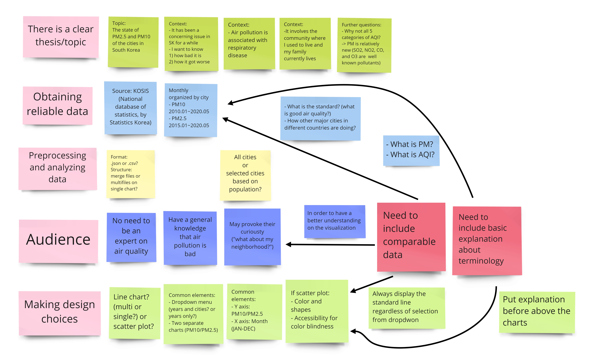
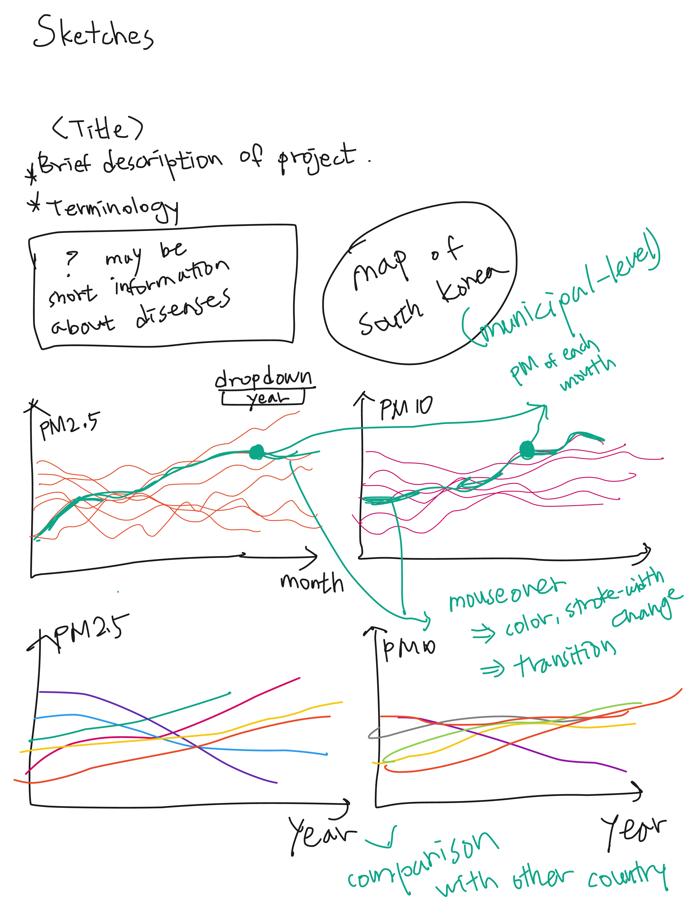

# DataViz_Spring2021_Project

## 1. Prospectus

For the last few years, deteriorating air quality has been a major issue in South Korea. I want to show the visualization that could answer the questions asking how bad the situation is, and how fast it got worse. The intended users for this project are people that are aware of the harmfulness of air pollution, but not necessarily experts on the air quality. I assume that some of them might have heard the terms like PMf10 or PM2.5 once or twice from the news. A dataset of monthly and annually recorded PM2.5 or PM10 of the major cities in South Korea, released by Bureau of Statistics, will be used for this project. I am also considering using the same data of NYC to compare. For the additional analysis, brief explanation about air pollution-related diseases can be shown together. The layout of the visualization has yet to be designed.

## 2. Brainstorming

Topic: Monthly changes of PM10 and PM2.5 in the cities of South Korea by year
Research question: 1) How bad it is? 2)
Signiciance: This may give the audience an opportunity to think about the air quality of their own community

## 3. Sketches

