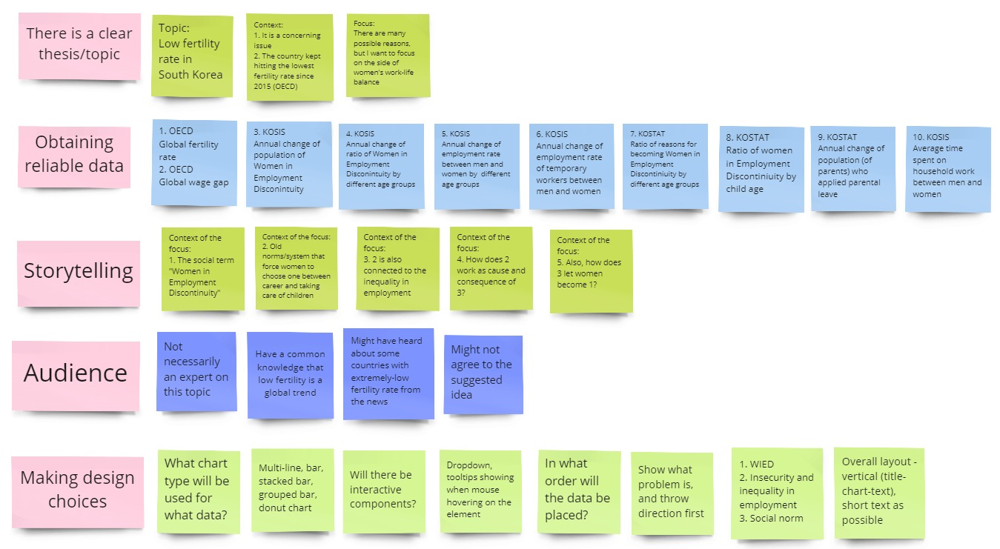
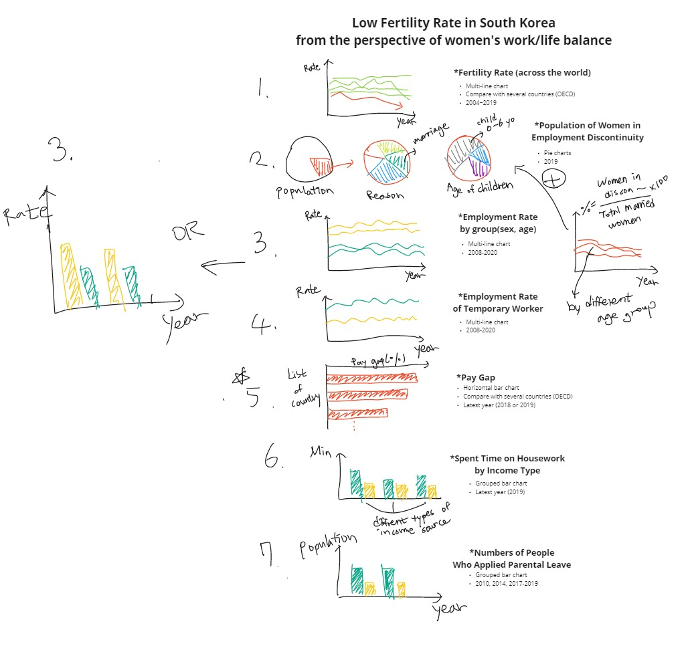

# Narrative Visualization

## 1. Prospectus

This project concerns the context of low fertility rate in South Korea, especially from the perspective of women's work-life balance. Various reports and articles that are trying to explain the most contributing cause of this issue have been published. However, the debate is still ongoing since too many relevant factors are intertwined. I would like to put possible reasons for the current fertility rate togehter in order to see more broader contextual narrative. The project will begin from the idea that the expectation of the younger generation on the qualitiy of life is low, and why it is happening. I assume that the audiences are not the experts on this issue, but they might have heard about the aging society problem, or the demographic cliff problem just like I had. I am planning to use multiple data sets provided by Bureaou of Stats, such as housing prices, sucide rates, age at the firt marriage, wage gap, careear discontinuity of female labor force and sex-selective abortion in the past. The overall layout of the project is yet to be designed.

## 2. Brainstorming

- Topic: Monthly changes of PM10 and PM2.5 in the cities of South Korea by year

- Research question: 1) What is PM? 2) How bad it is in South Korea?

- Signiciance: This may give the audience an opportunity to think about the air quality of their own community

## 3. Initial Sketches

